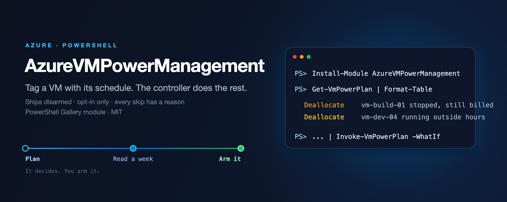

<p align="center"></p>

<p align="center">
  <a href="https://github.com/simon-vedder/azure-vm-power-management/actions/workflows/ci.yml"></a>
  <a href="https://www.powershellgallery.com/packages/AzureVMPowerManagement"></a>
  
  
  
</p>

**Tag a VM with the schedule it belongs to. The controller does the rest, and shows you what it did.**

Decides which Azure VMs should be off, proves what that saved, and hands the power operation to Azure.

## Why this exists

Azure ships the scheduler now. `Microsoft.ComputeSchedule` performs batched Start, Deallocate and
Hibernate across an estate, handles throttling and retries, and takes schedules up to fourteen days
ahead. Auto-shutdown has covered per-machine shutdown for years, free, from the portal. Building
another loop that calls `Start-AzVM` would ship a worse copy of a first-party feature.

What Azure does not do is decide *which* machines. Scheduled Actions takes a list of resource ids,
and nothing keeps that list right as machines are created, destroyed, moved or retagged. It has no
dry run, no blast radius, no freeze window. It cannot tell you what it saved, or why it skipped
something. And it has nothing to say about the most expensive mistake on the platform:

> A machine shut down from inside the guest sits in `PowerState/stopped` — allocated on a host, not
> running, and **still billed for compute**. Only `Deallocated` stops the meter. Microsoft's own
> FinOps guidance says to avoid this and offers no fix.

Finding those and deallocating them needs no schedule, no tags and no trust: the machine is already
powered off, so nothing that was running stops running. It is the first thing this tool does and the
first thing you can safely arm.

So this is not a scheduler. It is a **controller**: it turns intent into a membership list, guards
it, hands execution to Azure, and keeps the receipts.

## Quick start

Read-only, against any tenant you can read. Nothing is deployed and nothing changes.

```powershell
Install-Module AzureVMPowerManagement -AllowPrerelease
Connect-AzAccount

# What is powered off and still being billed for compute, across every subscription you can read?
Get-VmPowerPlan | Where-Object Reason -match 'Stranded|StoppedNotDeallocated' |
    Format-Table Name, ResourceGroup, VmSize, Reason
```

Then describe when machines should be up, and look at what that would do before anything else sees it:

```powershell
$office = New-VmPowerSchedule -Name office-hours-ch -TimeZone 'Europe/Zurich' -Weekdays '07:30-18:30'
$office | Show-VmPowerScheduleCalendar -Days 14

Get-VmPowerPlan -Schedule $office | Format-Table Name, Schedule, PowerState, Action, Reason
```

Tag a machine `PowerSchedule = office-hours-ch` and it is in scope. Remove the tag and it is not.

## How it decides

One Automation schedule fires the controller hourly. It is a heartbeat, not a calendar — Azure
Automation cannot run more often than that, and it does not need to, because each run plans the hour
ahead and hands Azure the exact times.

```
Automation Schedule (hourly)
   └─▶ the controller
         ├─ read the catalogue        PM_ScheduleCatalog + PM_ScheduleCatalogCustom
         ├─ discover                  one Resource Graph query, every readable subscription
         ├─ resolve                   tag value → schedule → what it wants right now
         ├─ observe                   power state, Stopped vs Deallocated
         ├─ decide                    pure functions, no Azure calls
         ├─ guard                     armed? blast radius? dwell? protected?
         ├─ act                       Azure performs it
         └─ record                    every decision and every skip, with the reason
```

Nothing about a machine is stored anywhere. Membership is recomputed from tags on every run, so a
machine created at 11:00 is managed at 12:00 and one deleted at 13:00 stops mattering at 14:00.

| Machine is | Schedule wants it up | Schedule wants it down |
|---|---|---|
| Running | left alone | **deallocated** |
| Deallocated | **started**, while the start is recent | left alone |
| `Stopped` (billed) | **deallocated** | **deallocated** |

The last row is deliberate. Somebody shut that machine down from inside the guest; starting it back
would fight them, and it is billed until it is deallocated. So the tool stops paying for it and
leaves it alone — it does not restart it. See
[ADR 0007](docs/decisions/0007-start-only-while-the-start-is-recent.md).

## Schedules

A tag names a schedule; it does not contain one. `PowerSchedule: office-hours-ch`, not five
`AutoShutdown-*` tags encoding a small language nothing validates. One edit fixes a wrong schedule
for every machine that follows it, the tag value becomes an enum a policy can enforce, and
`Microsoft.Resources/tags/write` stops meaning "decide when production shuts down".

JSON is what a schedule is stored as, the way ARM JSON is what Bicep is stored as. You author with
`New-VmPowerSchedule`, check with `Show-VmPowerScheduleCalendar`, and store with
`Set-VmPowerSchedule` — no redeployment. The catalogue lives in **two** Automation variables: the
deployment owns and overwrites one, nothing but `Set-VmPowerSchedule` writes the other, and a custom
entry wins on a name collision. That is why a redeployment cannot eat your work.

No holiday calendar ships with this tool. Switzerland alone has cantonal holidays, and a calendar
that looks authoritative and is wrong is worse than none — `-ExceptDate` is yours to fill in.

## Safety

It ships **disarmed**. The deployed schedule runs every hour, decides everything, writes every
decision to the job log, and touches no machine. Read a week of that, then set `PM_Armed` to `true` —
one edit in the portal, not a redeployment.

- **Opt-in, never opt-out.** No tag, never touched. There is no "manage this whole subscription" switch.
- **Blast radius.** A run that would act on more machines than you allowed performs none of them and
  says so. A bad catalogue edit becomes a report, not an incident.
- **Deallocate, never Stop**, always with a graceful shutdown. Force is an explicit opt-in.
- **Minimum dwell.** Azure bills a five-minute minimum per start, so a schedule that flaps costs money
  as well as being wrong.
- **Every skip is recorded with its reason**, so "why didn't it stop last night" has an answer.
- **An exclusion tag beats every rule**, whatever else is true.

This is a tool for development and test estates. [When not to use
this](docs/when-not-to-use-this.md) names what to keep out of scope, and
[KNOWN-ISSUES.md](KNOWN-ISSUES.md) lists every sharp edge found so far, with where it came from.

## Deploy the controller

[](https://portal.azure.com/#create/Microsoft.Template/uri/https%3A%2F%2Fraw.githubusercontent.com%2Fsimon-vedder%2Fazure-vm-power-management%2Fmain%2Fdeploy%2Fazuredeploy.json)

```bash
az deployment sub create -l westeurope -f deploy/main.bicep \
  -p moduleVersion=0.1.1 maximumActions=25 targetResourceGroupName=rg-target
```

One subscription-scope deployment creates an Automation Account with a system-assigned identity, a
least-privilege custom role, the module import from the PowerShell Gallery, the runbook, its hourly
trigger, every setting as an Automation variable, and a Log Analytics workspace for job logs. Start
with `targetResourceGroupName` so the role is scoped to one resource group. Details in
[deploy/README.md](deploy/README.md).

## Permissions

The controller's managed identity gets a custom role with four actions and no more:

```
Microsoft.Compute/virtualMachines/read
Microsoft.Compute/virtualMachines/start/action
Microsoft.Compute/virtualMachines/deallocate/action
Microsoft.Resources/subscriptions/resourceGroups/read
```

Reader cannot do the two that matter. Virtual Machine Contributor can, and can also install
extensions — which is code execution as SYSTEM or root on every machine in scope.

Running the read path yourself needs only **Reader** on the subscriptions in question: Resource Graph
returns what you can already read, so a narrower assignment narrows the report rather than failing
it. Authoring schedules needs
`Microsoft.Automation/automationAccounts/variables/read` and `/write` on the Automation Account.

## The version before this one

The tag-driven runbook that this replaces is in [`legacy/`](legacy/), not deleted, and also at the
git tag `legacy/tag-driven`. It works, it is what ran in production, and it stays until this rebuild
has proved itself inside a real Automation Account. `legacy/README.md` says what the differences are
and how to run it.

## Status

Pre-release `0.1.0-preview`. What is verified is in [docs/verification.md](docs/verification.md);
what is not is in [KNOWN-ISSUES.md](KNOWN-ISSUES.md).

## Documentation

- Tool page: [simonvedder.com/tools/vm-power-management](https://simonvedder.com/tools/vm-power-management)
- [Command reference](docs/commands) generated from the comment-based help
- [Verification log](docs/verification.md), [known issues](KNOWN-ISSUES.md), [when not to use this](docs/when-not-to-use-this.md)
- [Architecture decisions](docs/decisions), [releasing](docs/release.md), [contributing](CONTRIBUTING.md), [security](SECURITY.md), [changelog](CHANGELOG.md)

## License

MIT.
